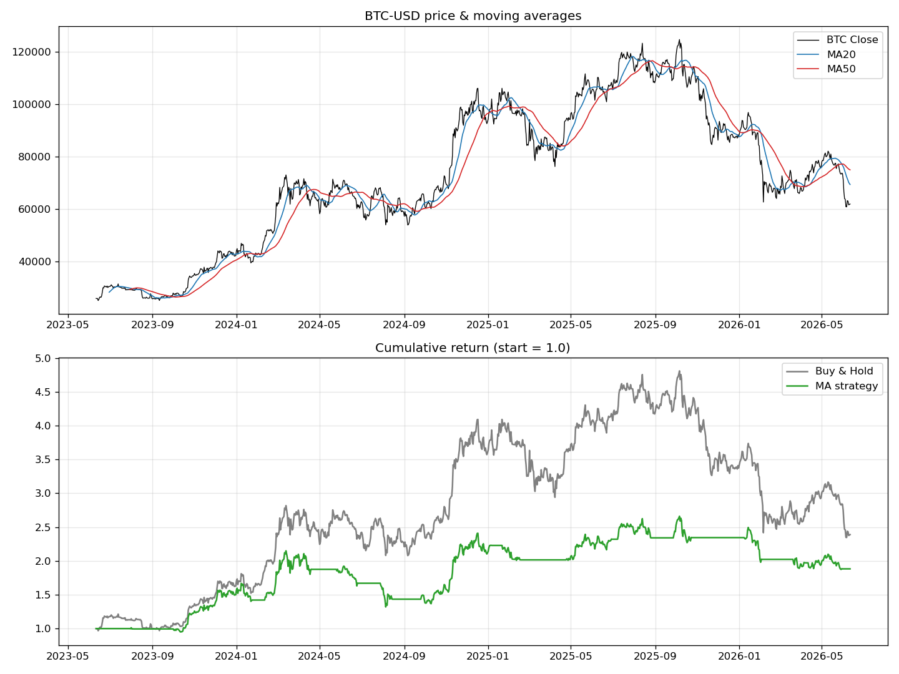

# #1 — 이동평균 교차(MA Crossover) 전략 백테스트

> 📝 블로그 글: https://cho-jeongbin55.tistory.com/1

단기 이동평균(20일)이 장기 이동평균(50일)을 위로 뚫으면 매수, 아래로 뚫으면 매도하는
**골든/데드크로스** 전략을 비트코인 3년 데이터로 백테스트합니다. 단순 보유(Buy & Hold)와
수익률·최대낙폭(MDD)을 비교합니다.

미래참조(look-ahead bias)를 막기 위해 신호를 `shift(1)`로 하루 미뤄 **다음 날 진입**합니다.

## 실행

```bash
pip install -r ../requirements.txt
python btc_ma_backtest.py
```

## 결과



| 지표 | 매수보유 | MA 전략 |
|---|---|---|
| 총수익률 | +138.9% | +88.3% |
| 연환산(CAGR) | 33.7% | 23.5% |
| 최대낙폭(MDD) | −51.2% | **−38.6%** |
| 거래 횟수 | 1회 | 28회 |

전략은 상승장에서 시장을 못 이겼지만, 낙폭은 더 작았습니다 — 가치는 "더 버는 것"이
아니라 **"덜 잃는 것"(하락 방어)** 에 있습니다.
