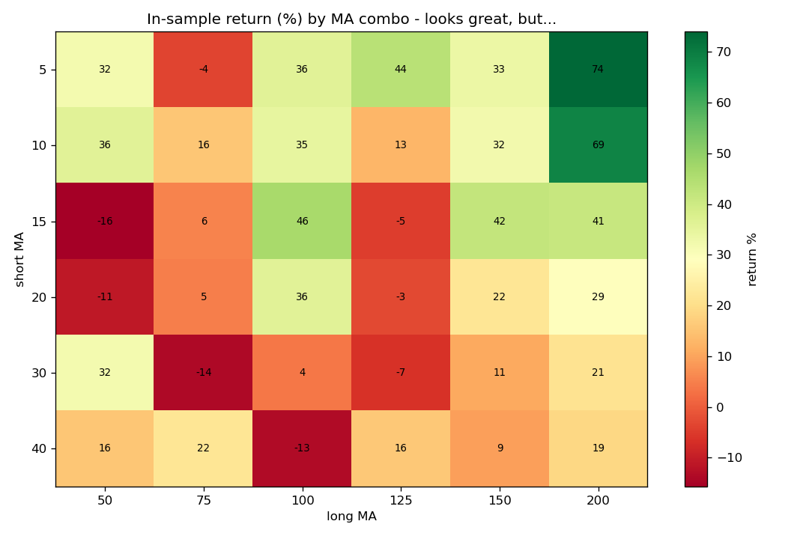

# #2 — 파라미터 과최적화(오버피팅)의 함정

> 📝 블로그 글: (발행 후 링크)

"가장 수익 좋은 이동평균 조합을 찾아 쓰면 되지 않나?" — 이 생각이 왜 위험한지를
데이터로 보여줍니다. 5년 데이터를 전반부(최적화용, in-sample)와 후반부(검증용,
out-of-sample)로 나눠, 전반부 36개 조합 중 챔피언을 골라 후반부에 적용합니다.

## 실행

```bash
pip install -r ../requirements.txt
python param_optimization.py
```

## 결과



| 구간 | MA 5/200 (전반부 챔피언) |
|---|---|
| 전반부(최적화) 수익률 | **+74.0%** |
| 후반부(실전 검증) 수익률 | **−2.8%** |
| 후반부 단순 보유 | +51.9% |

전반부에서 +74%로 빛나던 조합이 후반부 실전에서는 −2.8% 손실. 그냥 들고만 있었어도
+51.9%였습니다. **화려한 백테스트일수록 과최적화를 의심**해야 하는 이유입니다.
