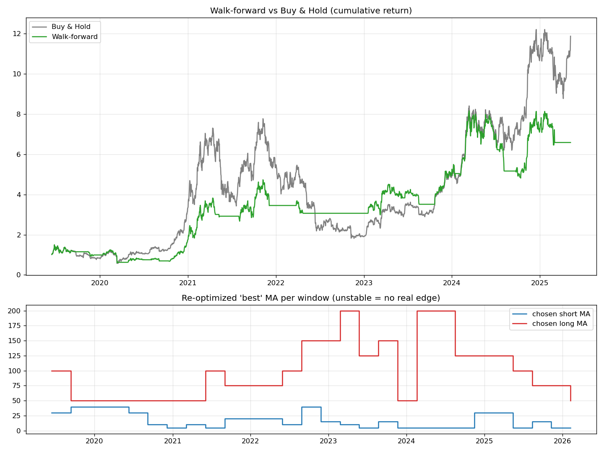

# #3 — 워크포워드 분석(Walk-Forward Analysis)

> 📝 블로그 글: https://cho-jeongbin55.tistory.com/3

데이터를 한 번만 나누는 2편을 넘어, **창을 굴려가며 주기적으로 재최적화**하는
실전형 검증입니다. 학습 1년 → 검증 3개월 → 3개월씩 전진하며 반복. 매번 '미래'는
보지 않고 파라미터를 갱신합니다. 거래비용에 **슬리피지(0.05%)** 도 반영했습니다.

## 실행

```bash
pip install -r ../requirements.txt
python walkforward_backtest.py
```

## 결과 (BTC, 검증구간 2019-06 ~ 2025-05, 약 6년 / 재최적화 28회)



| 지표 | 단순 보유 | 워크포워드 |
|---|---|---|
| 총수익률 | +1087.5% | +558.7% |
| CAGR | 52.1% | 37.6% |
| MDD | −76.6% | **−59.9%** |

**두 가지 결론:**
1. 가장 정직한 검증에서도 전략은 단순 보유를 못 이김 — 단 MDD는 17%p 방어.
2. 28번 재최적화했더니 '최적 조합'이 **16개나 난립**(최다 3회) → 안정적인 엣지가 없다는 증거.
