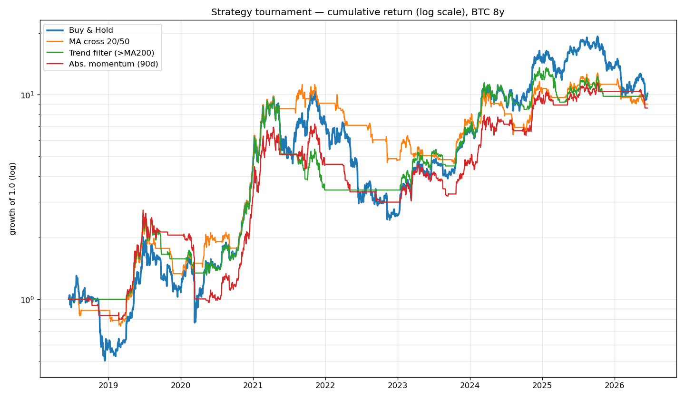

# #4 — 전략 토너먼트: '덜 잃는' 전략 찾기

> 📝 블로그 글: https://cho-jeongbin55.tistory.com/4

1~3편 결론은 "단순 이동평균으로 **총수익**에서 단순 보유를 이기긴 어렵다" 였다.
그래서 목표를 바꾼다 → **"비슷하게 벌되 훨씬 덜 잃는다" = 위험조정수익으로 이기기.**
(측정: Sharpe = 변동성 1단위당 수익, MAR = 낙폭 1단위당 수익)

## 코드

| 파일 | 내용 |
|---|---|
| `strategy_comparison.py` | 4개 전략(단순보유/MA교차/추세필터/절대모멘텀) 토너먼트 |
| `multi_asset_trend.py` | 추세필터를 6개 자산(BTC·SPY·QQQ·AAPL·GLD·삼성전자)에 적용해 견고성 확인 |
| `walkforward_trend.py` | 추세필터를 워크포워드로 정밀검증 |

## 핵심 결과

**토너먼트 (BTC 8년)** — 총수익은 단순보유가 1위지만, **위험조정수익(Sharpe·MAR)은
4개 전략 전부 단순보유를 이김.** 우승: 추세필터(>MA200), Sharpe 0.88.

**견고성** — 추세필터는 6개 자산 중 5개에서 낙폭(MDD) 개선. BTC가 궁합 최고
(유일하게 수익·낙폭·Sharpe 전부 개선).

**워크포워드 검증 통과** — 가장 엄격한 검증에서도:

| 지표 | 단순보유 | 추세필터 WF |
|---|---|---|
| 총수익 | +822% | +716% |
| MDD | −76.6% | **−54.5%** |
| Sharpe | 0.84 | **0.89** |

→ "비슷하게 벌고 훨씬 덜 잃는다" 달성. **실거래(모의투자) 후보 1순위.**
