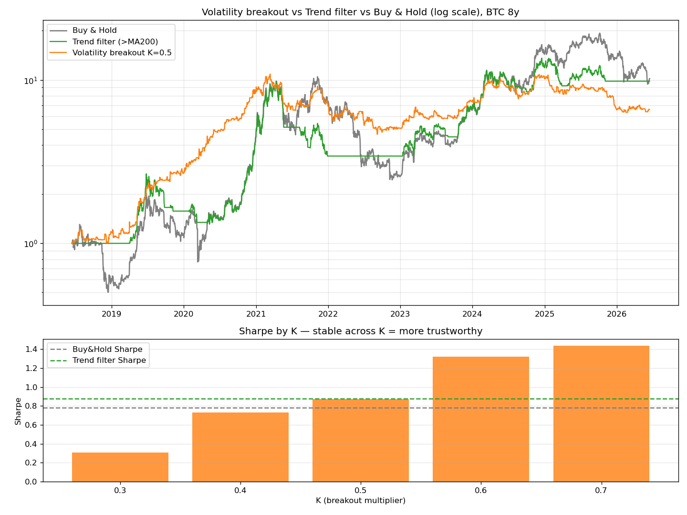

# #5 — 변동성 돌파(래리 윌리엄스): 유명세 vs 현실

> 📝 블로그 글: https://cho-jeongbin55.tistory.com/5

한국 퀀트 커뮤니티에서 가장 유명한 전략. 우리 틀로 정직하게 검증했다.

**규칙:** 목표가 = 오늘 시가 + K × (전일 고가−저가). 장중 고가가 목표가를 돌파하면
당일 매수, 당일 종가 청산. (K = 돌파 민감도)

## 코드

| 파일 | 내용 |
|---|---|
| `volatility_breakout.py` | K 0.3~0.7 스윕, 단순보유·추세필터와 비교 |
| `walkforward_breakout.py` | 워크포워드로 K를 재최적화하며 정밀검증 |

## 핵심 결과 — "환상 1.44 → 현실 0.92"

**1차 백테스트:** K=0.7에서 Sharpe **1.44**, 총수익 1556%. 너무 좋아 보임.
하지만 K를 0.3→0.7로 바꾸면 Sharpe가 0.31→1.44로 4배 — **K 민감도 = 과최적화 경고.**

**워크포워드 (K를 미리 모른다고 가정):**

| 전략 | 총수익 | MDD | Sharpe |
|---|---|---|---|
| Buy & Hold | 822% | −77% | 0.84 |
| 변동성 돌파 WF | 393% | **−49%** | **0.92** |

→ 1차의 1.44는 거품이 섞여 0.92로 내려앉았지만(과최적화 프리미엄 실재),
**그래도 Sharpe·MDD에서 단순보유를 이김 = 실제 엣지는 있다.** 특히 낙폭 방어 최강.

**반전:** K를 매번 재최적화한 것(0.92)보다 K=0.7로 **고정**한 게 더 좋았다(1.24).
→ "파라미터를 부지런히 갱신하는 게 늘 정답은 아니다."
