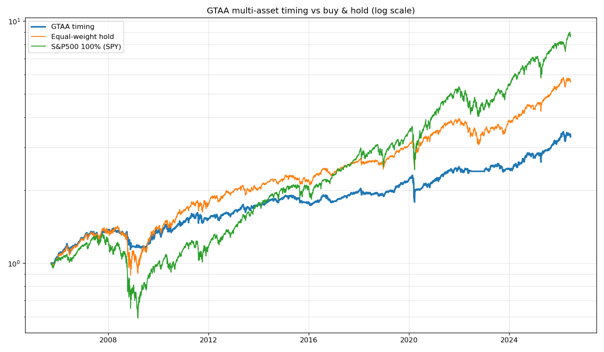

# #7 — 자산배분(GTAA): '덜 잃기'의 정석

개별 종목·단일 자산을 떠나, 여러 **자산군에 분산**하고 각각 추세를 타는
**GTAA(Global Tactical Asset Allocation, Meb Faber)** 를 검증했다. 1~6편에서
"분산이 가장 큰 무료 점심"이라는 결론에 도달했고, 그 정석을 직접 돌려본 편.

## 규칙 (단순함이 미덕)

- 자산 5종: 미국주식(SPY)·선진국주식(EFA)·미국채(IEF)·금(GLD)·부동산(VNQ)
- 매월 말, **각 자산이 200일 이동평균 위면 보유, 아래면 그 몫은 현금**
- 보유 자산은 **동일비중(1/5씩)**, 나머지는 현금

## 코드

| 파일 | 내용 |
|---|---|
| `gtaa_timing.py` | GTAA 백테스트(20년) — 단순보유·주식100%와 위험조정수익 비교 |

## 핵심 결과 (2005~, 약 20년)

| 전략 | 총수익 | MDD | Sharpe |
|---|---|---|---|
| SPY 100% | 780% | −55% | 0.64 |
| 동일가중 분산보유 | 471% | −37% | 0.69 |
| **GTAA 타이밍** | 238% | **−23%** | **0.69** |

→ GTAA는 총수익은 가장 낮지만 **낙폭(MDD)을 −23%까지 줄였다(주식의 절반 이하).**
위험조정수익(Sharpe)은 주식 100%를 이긴다. **"비슷한 효율로 훨씬 덜 잃는다"** =
마음 편한 자산배분. 단, 동일가중 분산보유와 Sharpe는 동률 → *타이밍의 추가 알파는
"수익을 더"가 아니라 "낙폭을 더 줄이는" 쪽*이다.

> **이 전략으로 [#8 한투 모의투자](../08-kis-paper-trading/) 실전 연결로 넘어간다**
> (자산만 한국 상장 ETF 5종으로 옮겨 동일 메커니즘 재검증 → 합격).

*숫자는 yfinance 실시간 데이터라 실행 시점마다 조금씩 달라진다.*
